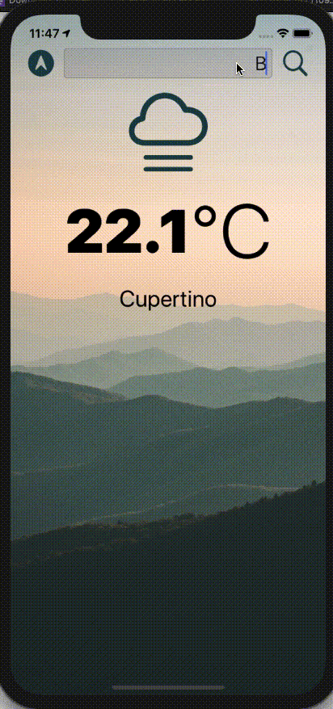

# SimpleWeather
## Simple Weather app using openweathermap api

### ToDo's
- [x] Simple API Request to Openweathermap
- [x] Simple interface for both day/night modes
- [x] Find Weather on location
- [x] Search for location
- [ ] Add Fahrenheit support
- [ ] Add Forecast
- [ ] Persist data

